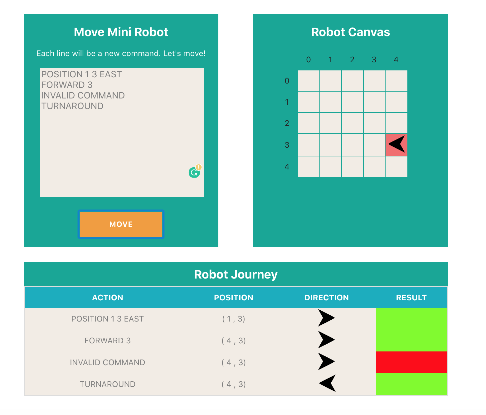

# Move Mini Robot Application

This project is to give movement to a mini robot on the grid (5x5). 

In this project you will give some commands to the mini robot and it will move the position which you want to send.

Robot starting position is always is {0,0} EAST. 


After you write your commands robot will move the final position on the grid by using `position-service` as backend service. `position-service` provides required information for robot position according to the commands.

### Valid Commands 

* `POSITION {X} {Y} {DIRECTION}` -> Sets position {X,Y} in the selected Direction (EAST, WEST, NORTH, SOUTH)
* `FORWARD {X}`  ->  Move X steps 
* `RIGHT` -> Turns right in the current position
* `LEFT` -> Turns left in the current position
* `TURNAROUND` -> Turns back in the current position
* `WAIT` -> Waits in the current position

#### Important  Notes !
* Commands are not case sensitive, you can type small case also.
* Each new line is a new command. If you don't put new line between them, application wont run the rest of command in the line.
* You must put space for each parameters of the command.


## Sample 

Sample Command

You have to write all command in a new line. If command is not valid, robot wont move and stays current. position.

```text
POSITION 1 3 EAST
FORWARD 3
WAIT
TURNAROUND
FORWARD 1
RIGHT
FORWARD 2
```

Result



## Running Application

There are 2 ways to run:

1)  Running `docker-compose` file 
2)  Running separated each application `robot-client` and `position-service` by looking each application README file.  

### Running application by using docker-compose 

To run applications `robot-client` and `position-service` together. 
You can run `docker-compose.yml` file by using the command.

#### `docker-compose up`

After docker containers build and run `robot-client` application will run on your local `http://localhost:3000` 
and `positon-service` will serve `http://localhost:8080`

#### `docker-compose stop`

To stop all running containers which the compose file was created.

#### `docker-compose kill`

To kill all running containers which the compose file was created.

# Have Fun !

