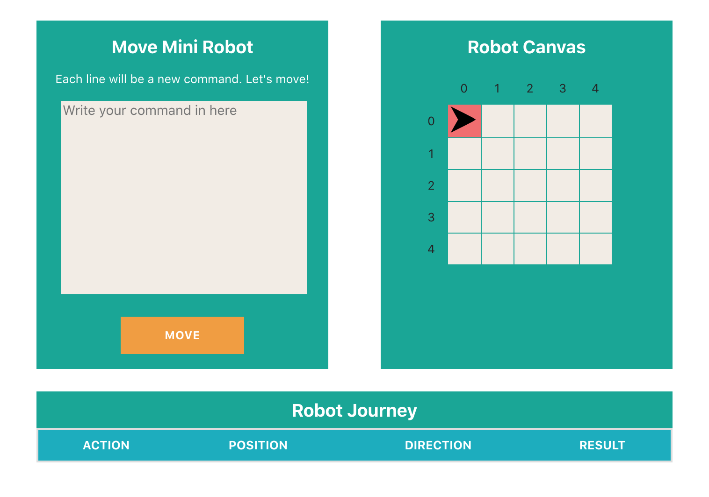

# Move Mini Robot Application

This project is to give movement to a mini robot on the grid (5x5). 

In this project you will give some commands to the mini robot and it will move the position which you want to send.



After you write your commands robot will move the final position on the grid.

### Valid Comands 

* `POSITION {X} {Y} {DIRECTION}` -> Sets position {X,Y} in the selected Direction (EAST, WEST, NORTH, SOUTH)
* `FORWARD {X}`  ->  Move X steps 
* `RIGHT` -> Turns right in the current position
* `LEFT` -> Turns left in the current position
* `TURNAROUND` -> Turns back in the current position
* `WAIT` -> Waits in the current position

#### Important  Notes !
* Commands are not case sensitive, you can type small case also.
* Each new line is a new command. If you dont put new line between them, application wont run the command.
* You must put space for each parameters of the command.


## Sample 

Sample Command

You have to write all command in a new line. If command is not valid, robot wont move and stays current. position.

```text
POSITION 1 3 EAST
FORWARD 3
WAIT
TURNAROUND
FORWARD 1
RIGHT
FORWARD 2
```

Result


## Libraries & Tools

* ReactJs
* Eslint
* Node Sass
* Docker

## Building Application

Installs all node dependecies

### `yarn install`

In the project directory, you can run:

### `yarn start`

Runs the app in the development mode.<br />
Open [http://localhost:3000](http://localhost:3000) to view it in the browser.

The page will reload if you make edits.<br />
You will also see any lint errors in the console.

### `yarn test`

Launches the test runner in the interactive watch mode.<br />
See the section about [running tests](https://facebook.github.io/create-react-app/docs/running-tests) for more information.

### `yarn build`

Builds the app for production to the `build` folder.<br />
It correctly bundles React in production mode and optimizes the build for the best performance.

The build is minified and the filenames include the hashes.<br />
Your app is ready to be deployed!

See the section about [deployment](https://facebook.github.io/create-react-app/docs/deployment) for more information.

## Needs To Improve

* Can be more component base.

